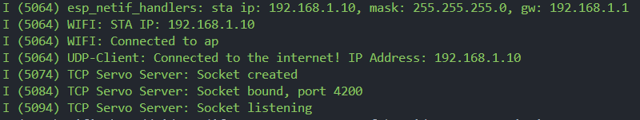

# ESP32 CAM Tasks
There 4 are main tasks performed by the ESP32 CAM:

- 2 servos sweeping $\text{360}\degree$ for scanning the surroundings
- The OV2640 Camera streaming camera data to a server using UDP
- Receiving angles for $\text{360}\degree$ rotation and $\text{180}\degree$ pitching for the directional speaker using TCP
- Using a GPIO pin to toggle the speaker on/off

## Building, Flashing and Monitoring the ESP32 CAM

1. Run the export script to write all relevant variables to the environment.<br>
    Linux:
    ```sh
    source $IDF_TOOLS_EXPORT_CMD
    ```
    Windows:
    ```ps
    # Assuming powershell is in this directory
    .\..\lib\esp-idf\export.ps1
    ```
1. In the `./udp_client` directory, the server config details must be added in `server_config.h`. This will be done by the python script in `../udp-socket-server/`.
1. In the `./wifi_conn` directory, the wifi connection config details must be added in `wifi_config.h`. The following format must be used:
    
    ```h
    #ifndef WIFI_CONFIG_H
    #define WIFI_CONFIG_H

    #define WIFI_SSID "your_wifi_ssid_here"
    #define WIFI_PW "your_password_here"

    #endif
    ```
1. Before connecting the ESP32 CAM to a USB port, short the `GND` and `IO0` pins.
    Make the following other connections to the FTDI Programmer:

    - `GND (FTDI)` $\space \space\space\space\space\Rightarrow$ `GND (ESP32 CAM)` 
    - `VCC/5V (FTDI)` $\Rightarrow$ `5V (ESP32 CAM)` 
    - `TXD/TX (FTDI)` $\Rightarrow$ `UOR (ESP32 CAM)` 
    - `RXD/RX (FTDI)` $\Rightarrow$ `UOT (ESP32 CAM)`
    <br>
    <br>
    
    <!--  -->
1. Determine the port on which the ESP32 CAM is connected<br>
    - Linux:<br>
      ```sh
      ls /dev | grep -E "(ttyACM|ttyUSB)"
    - Windows:<br>
      Open `Device Manager -> Ports (COM & LPT)`
    
1. Build, Flash and Monitor (from this directory)
    ```sh
    idf.py -p <COMx or /dev/ttyUSBx or /dev/ttyACMx> build flash monitor
    ```
    on Windows, the path lengths can exceed the default limit while building, causing build to fail. Use the following command instead:
    ```sh
    idf.py --no-ccache -p <COMx or /dev/ttyUSBx or /dev/ttyACMx> build flash monitor
    ```
1. Press the `RST` button to reset the ESP32 CAM, booting it up with the newly flashed program 
1. Run the TCP client python script in `../tcp-socket-client`. Using the IP address and port of the TCP server running on the ESP32 CAM, which is mentioned in the logs, enter them in the TCP client script:
    

## Build Order

- Run the Python script for the UDP Server for image transfer in `../udp-socket-server`
- Follow the steps given above to run the ESP32 CAM
- Use the IP address of the ESP32 CAM and the port no. to run the TCP client for angle transfer in `../tcp-socket-client`